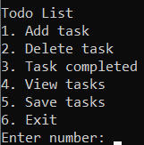

# **Todo List**

A Todo List manager to add, delete and complete tasks.

## **Project Overview**  
It's a Python program that runs in the terminal and provides users with a way to manage their tasks easily.

## **Features**  
- Add tasks  
- Delete tasks  
- Mark tasks as completed  
- View all tasks  

## **How to Run the Project**  
1. Clone the repository:  
   ```bash
   git clone https://github.com/sadrekha/TD1-Decentralization-Technologies.git  
   cd TD1-Decentralization-Technologies  
   python todo.py  
   ```

## **Commands in the Application**  
- **1. Add a Task:** Adds a new task to the list.  
- **2. Delete a Task:** Removes a task based on its number.  
- **3. Mark a Task as Completed:** Marks a task as completed.  
- **4. View Tasks:** Displays all tasks.  
- **5. Save Tasks:** Saves all tasks into a tasks.txt file.
- **6. Exit:** Exits.  

## **Sample Usage**  
```plaintext
Todo List  
1. Add task  
2. Delete task  
3. Task completed  
4. View tasks 
5. Save tasks 
6. Exit

Enter number: 1  
Task description: Finish feature
Due date: 10/02
Task added!  
```

Example screenshot:


## **How to Contribute**  
```bash
# 1. Fork the repository.  
# 2. Create a new branch:  
git checkout -b new-feature  

# 3. Make your changes and commit:  
git add .  
git commit -m "Add new feature"  

# 4. Push your branch:  
git push origin new-feature  

# 5. Open a pull request.
```

## **License**  
This project is licensed under the MIT License. See `LICENSE` for more details.
